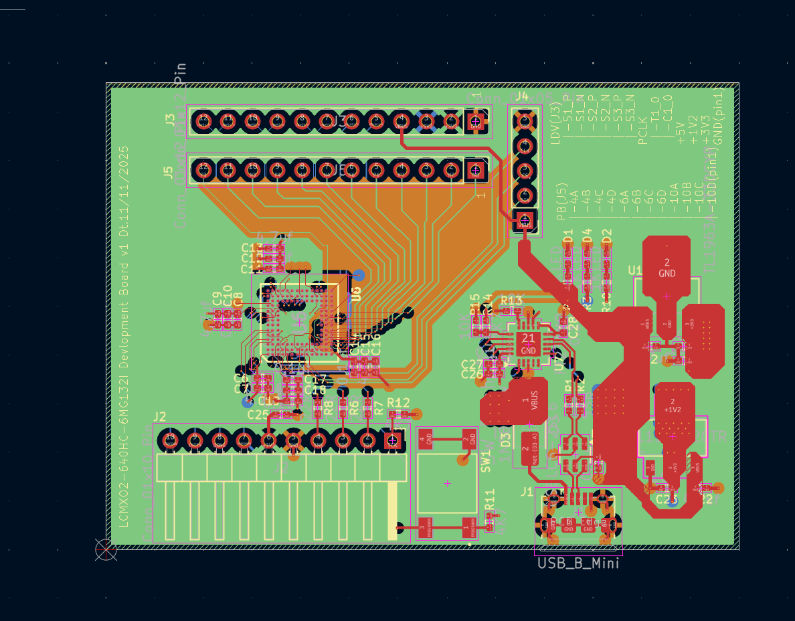
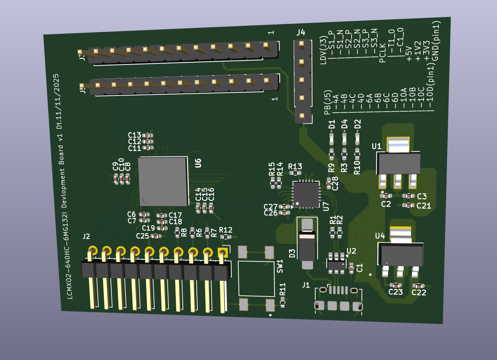

# MachXO2-640HC FPGA Breakout Board - KiCad Design 🛠️

> Custom breakout board for Lattice **LCMXO2-640HC-6MG132I** - Designed in KiCad 9.0.3 - 8 Sheets Hierarchical - By Jay Waghmare, Pune, India

  
   <em>3D Render - MachXO2-640HC Board (KiCad 3D View)</em>

## 🌟 What Is This? (From My Schematic PDF)

Custom FPGA development board designed from scratch in KiCad for **Lattice MachXO2 LCMXO2-640HC-6MG132I** (640 LUTs, 132-ball CSBGA).

**Full breakout board, not simple LED:**

- USB Mini-B (J1) for power + data with ESD protection USBLC6-2SC6 (U2)
- Dual LDO: 5V→3.3V TL1963A-33DCYR (U4) and 5V→1.2V LD1117S12CTR (U5) for core + I/O
- FT231XQ USB-UART bridge (U7) for serial
- JTAG header 1x10 (J2) for Lattice HW-USBN-2B programmer (10 flywires - White TCK, Orange TDI, Brown TDO, Purple TMS...)
- All 4 I/O Banks broken out: Bank0 Top (PT6A...), Bank1 Right (PR28... LVDS), Bank2/3 Left (PL2A...), Bank Bottom (PB4A...) + GND/NC
- Power LEDs D1 D2, User LEDs, Button SW1 for PROGRAMN

Why I made my own? To learn FPGA hardware - Power sequencing, decoupling, JTAG, I/O banks.

**8 Sheets Hierarchical (KiCad 9.0.3, file MACHXO2_test.kicad_sch):**

| Sheet | File | Content |
|-------|------|---------|
| 1/8 | MACHXO2_test.kicad_sch | Top Level - Power, User_IO/Banks, Device_Management blocks |
| 2/8 | Power.kicad_sch | Power: USB Mini, 3.3V/1.2V LDOs, FPGA VCC/VCCIO decoupling C6 0.1uF C7 4.7uF etc, VCCIO table |
| 3/8 | USER_IO_Bank_T | Bank0 Top - U6B LCMXO2 Bank0, JTAG TDO/TDI/TCK/TMS, J3 12-pin socket |
| 4/8 | USER_IO_Bank_R | Bank1 Right - U6C Bank1, LVDS1/2/3, PCLK, J4 10-pin header |
| 5/8 | USER_IO_Bank_L | Bank Left - U6D Bank Left PL2A...PL7B |
| 6/8 | USER_IO_Bank_B | Bank Bottom - U6E Bank Bottom PB4A...PB14B |
| 7/8 | USER_Config | Config - JTAG J2, PROGRAMN button SW1, FT231XQ UART, JTAG header flywire table |
| 8/8 | GND&NC | GND & NC - U6F/U6G NC pins and GND balls |

## ✨ Board Features (From Schematic)

- **FPGA:** U6 LCMXO2-640HC-6MG132I, 640 LUTs, MG132I, Speed 6
- **Power:** J1 USB Mini-B, D3 1N5819HW?, U2 USBLC6-2SC6 ESD, U4 TL1963A-33DCYR 5V→3.3V (C2 4.7uF, C3 10uF, C21 10uF), U5 LD1117S12CTR 5V→1.2V (C22 4.7uF, C23 10uF, C24 10uF), D1 D2 power LEDs with R8 1K, C6 0.1uF C7 4.7uF per +1V2, C8 0.1uF C10 1uF C9 4.7uF per +3V3 bank - Proper decoupling!
- **Recommended VCCIO (Your Table):** PB left 3.3V (sensors, SPI flash), PL lower 1.8V (low-voltage memory), PR right 1.8V/2.5V (high-speed), PT top 3.3V (UART, SPI, USB-UART)
- **JTAG:** J2 1x10 header, R6 R7 R8 22R series for TDO/TDI/TCK/TMS, R11 4K7 pull-up for PROGRAMN, SW1 dual push button, Notes: INITN B13 open-drain float OK, JTAGENB B9 float OK (internal weak pull-up)
- **UART:** U7 FT231XQ with C26 4.7uF C27 0.1uF C28 0.1uF, TXD_FTDI, RXD_FTDI, RTS_FTDI, CTS, VBUS detection R1 4K7 + R13 10K divider
- **JTAG Programmer:** Lattice HW-USBN-2B USB cable with 10 flywire - Official tool - TCK White 4.7K to GND, TDI Orange 22R series, TDO Brown direct, TMS Purple 22R series, GND Black, VCC Red 0.1uF, PROGRAMN Yellow 4.7K+btn, DONE Blue LED+330Ω, INITN Green float, JTAGENB Gray float

## 📁 Files (Your Actual Uploads - Live)

**You uploaded:** .kicad_pro, .kicad_sch, .kicad_pcb, .kicad_prl, schematic.pdf, 3d-render.png, pcb_preview.png - Full project!

## 📸 Photos / Renders

| Schematic PDF | PCB Preview | 3D Render |
|---------------|-------------|-----------|
| [schematic.pdf](hardware/schematics/schematic.pdf) (8 pages) |  |  |

  
  

## 📦 How to View

1. Install KiCad 9.0.3: https://kicad.org/download/
2. Clone: git clone https://github.com/jay-waghmare/MachXO2-KiCad-Board.git
cd MachXO2-KiCad-Board
3. Open `MACHXO2_test.kicad_pro` → Schematic Editor (8 sheets) → PCB Editor → 3D View

## 🗺️ Roadmap

- [x] KiCad hierarchical schematic 8 sheets - LCMXO2-640HC - Done (your PDF)
- [x] Upload .kicad_pro, .kicad_sch, .kicad_pcb, .kicad_prl - Done (5-6 greens today!)
- [x] Upload schematic.pdf + 3D renders - Done 5 mins ago!
- [ ] Add hardware/bom.md with exact values from schematic
- [ ] Add docs/design.md - Why 640HC, why TL1963A + LD1117, why 132-ball
- [ ] Export Gerbers: File → Fabrication Outputs → Gerbers → hardware/pcb/gerbers.zip
- [ ] Fabricate at JLCPCB
- [ ] Bring-up: Power test 3.3V/1.2V, JTAG scan with HW-USBN-2B, first blinky
- [ ] Add real board photos

## 👨‍💻 Author

**Jay Waghmare** - FPGA 
- GitHub: [@jay-waghmare](https://github.com/jay-waghmare) 
- Board: LCMXO2-640HC-6MG132I custom breakout - Designed from scratch in KiCad 9.0.3

If you like FPGA hardware boards, please ⭐ star!

## 📄 License

MIT License

> Designed from scratch in KiCad 9.0.3 
